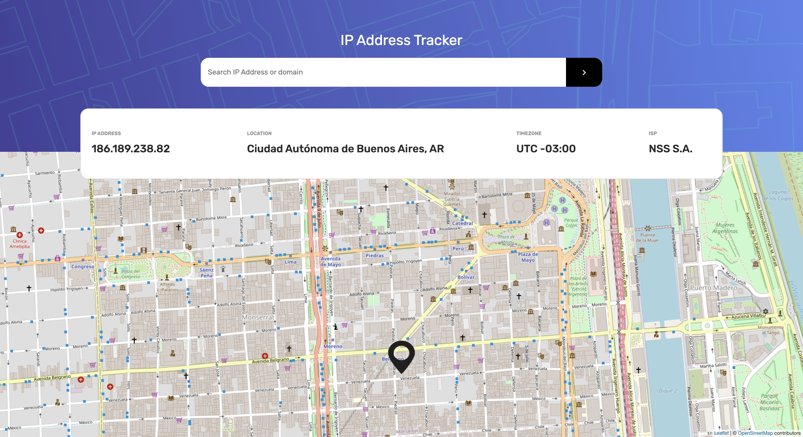
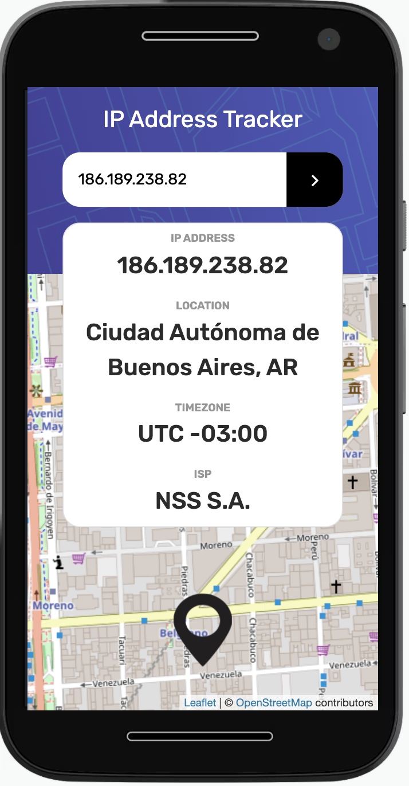

# 🔓IP Address Tracker

This is a solution to the [IP address tracker challenge on Frontend Mentor](https://www.frontendmentor.io/challenges/ip-address-tracker-I8-0yYAH0). It was built with React js, the map was generated by Leaflet, and the API geo.ipify was used for the requests.
## Table of contents

  - [The challenge](#the-challenge)
  - [Screenshot](#screenshot)
  - [Links](#links)
  - [Built with](#built-with)
- [Author](#author)

### 💡The challenge

Users should be able to:

- View the optimal layout for each page depending on their device's screen size
- See hover states for all interactive elements on the page
- See their own IP address on the map on the initial page load
- Search for any IP addresses or domains and see the key information and location

### 📷Screenshot

- Desktop version:

- Mobile version:

### 📌Links

- Live Site URL: [Live site url](https://mariapenaa.github.io/ip-address-tracker/)

### 🔨Built with

- Semantic HTML5 markup
- CSS custom properties
- SASS
- Flexbox
- [IP Geolocation API by IPify](https://geo.ipify.org/)
- [LeafletJS](https://leafletjs.com/).
- [React](https://reactjs.org/) - JS library

### 💁🏽‍♀️Author

<!-- - Website - [Maria Peña](https://www.your-site.com) -->
- Frontend Mentor - [@mariapenaa](https://www.frontendmentor.io/profile/mariapenaa)

